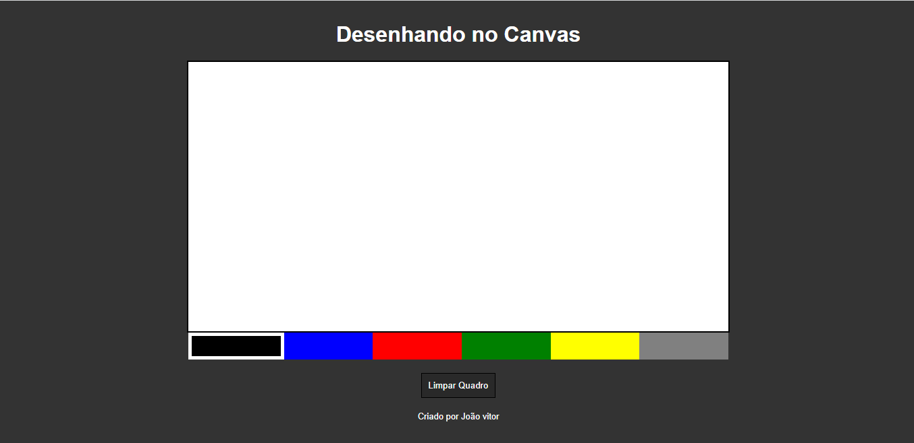

# 🛠 Tecnologias utilizadas:

  

  
   
  
  

 

# 💻  Sobre o Projeto:
<li>O Projeto Canva é uma página web que permite aos usuários realizar desenhos nele, os usuários podem usar diversas cores.</li>
 

# ⚙️ Funcionalidades:
<li>Na primeira seção da página, os usuários serão apresentados ao quadro de desenho.</li>
<li>Após clicar em qual cor que o usuário vai querer, ele ja pode desenhar clicando e segurando o botão direito do mouse.</li>
<li>Além de que, e apresentado um botão para limpar o quadro automaticamente.</li>

# 🎨 Pré-visualização :
## Apresentação do quadro de desenho:

# 🦸 Autor:

 
<a href="https://www.linkedin.com/in/jo%C3%A3o-vitor-ribeiro-dias-339a56258/" target="_blank">João Vitor RIbeiro Dias</a>